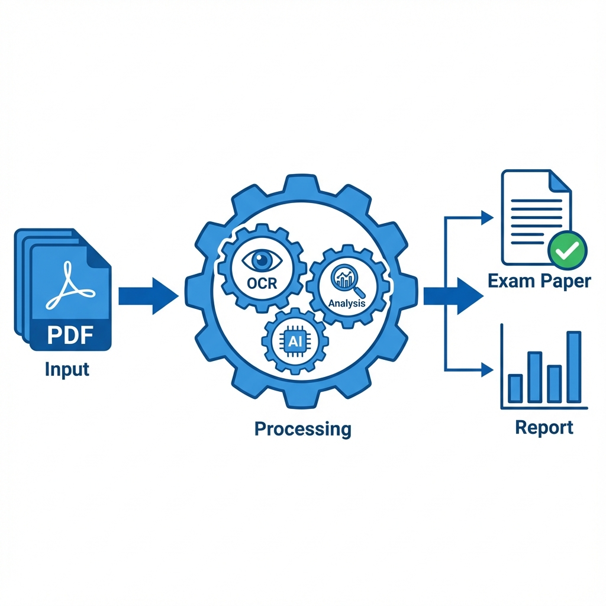
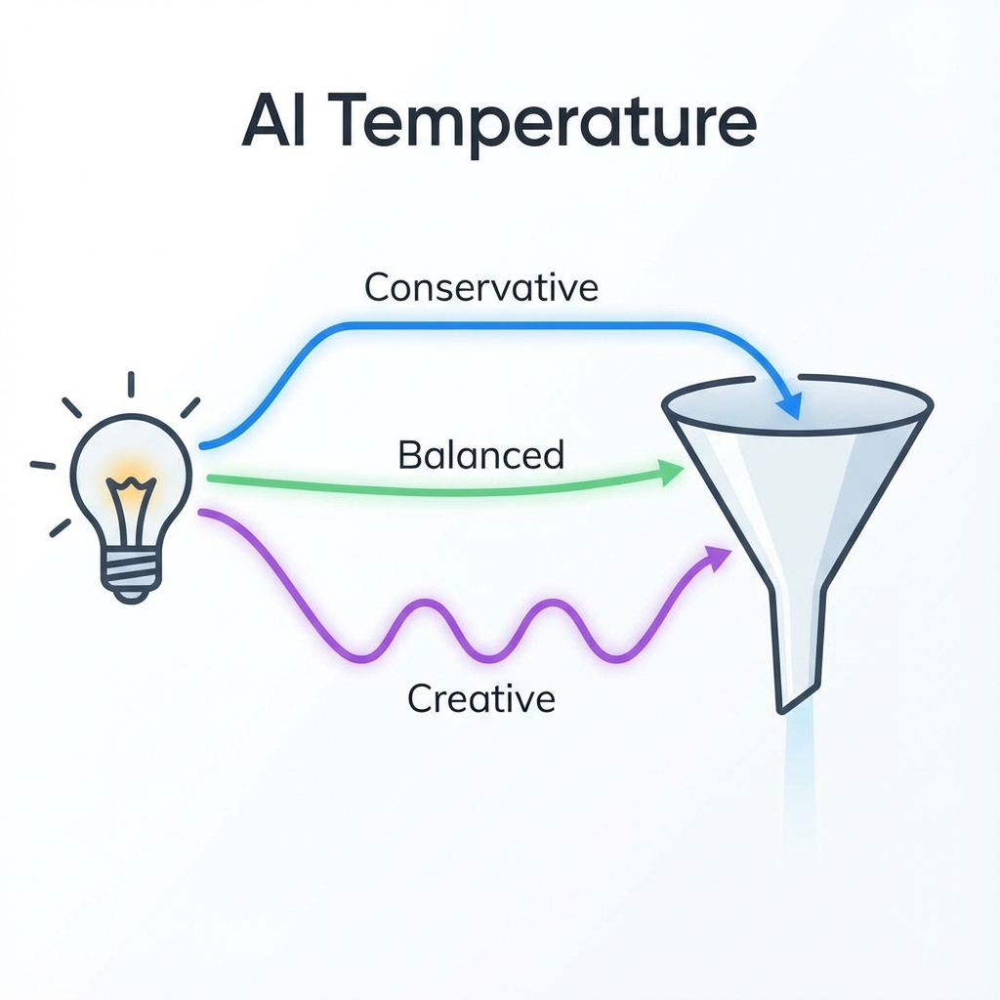
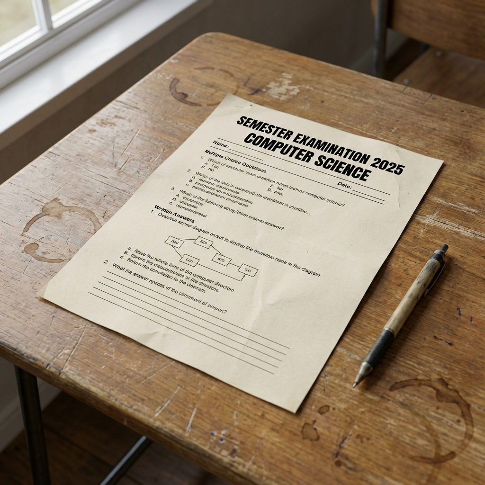
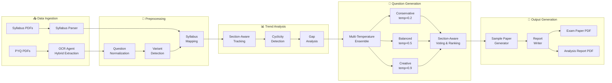
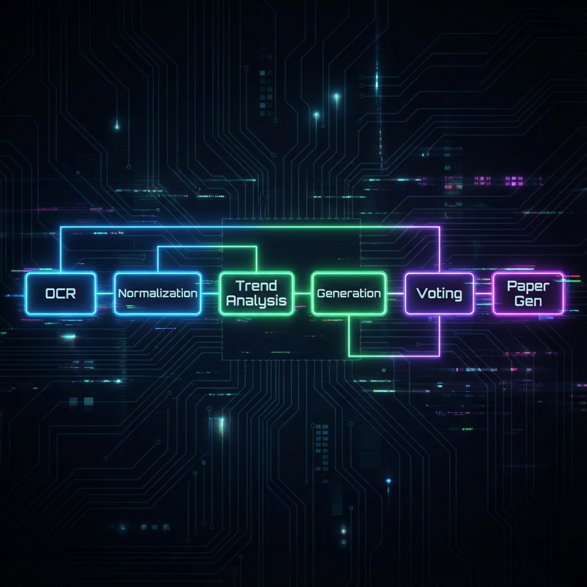
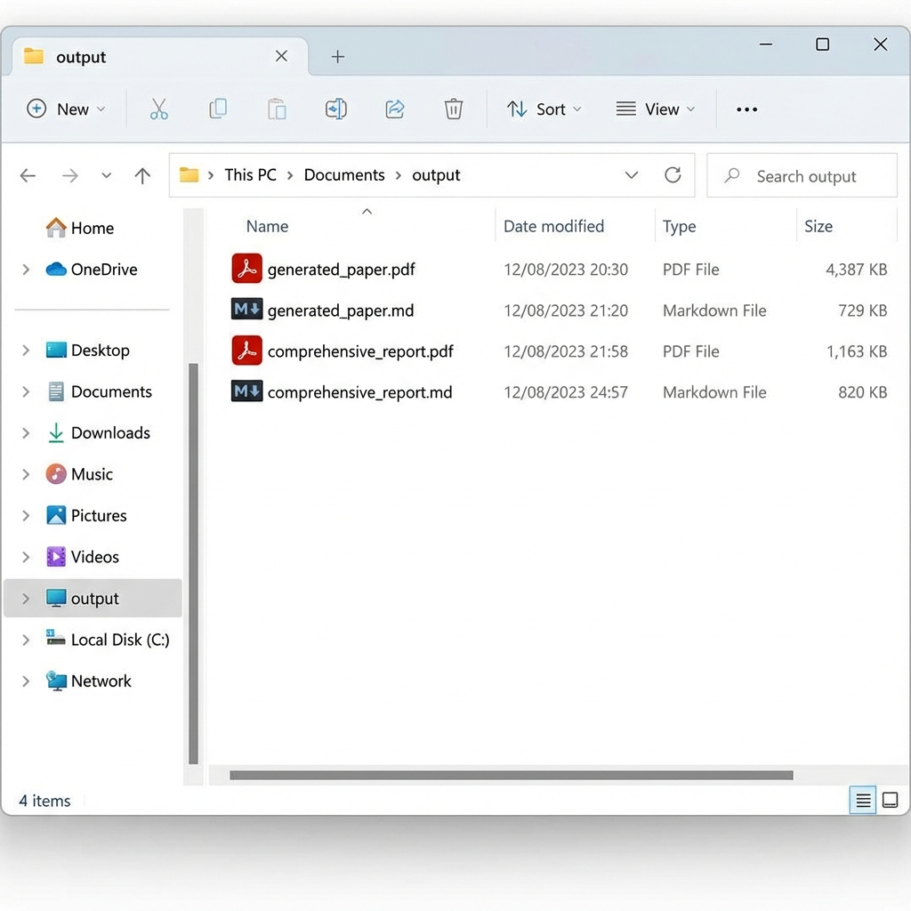
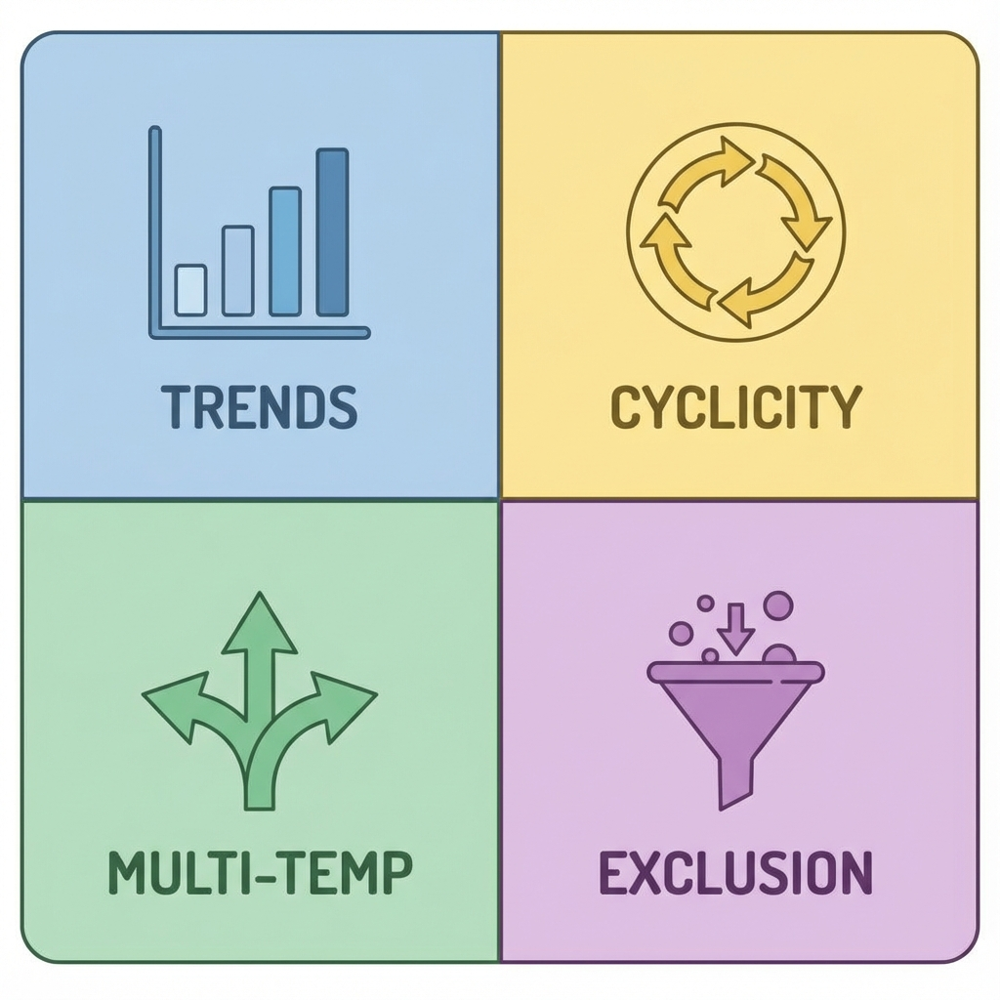

# 🎓 Kripaa - Semester Exam Paper Prediction System

<div align="center">


**Intelligent exam paper generation using historical analysis, trend detection, and multi-LLM ensemble**

[](https://www.python.org/)
[](LICENSE)
[](https://github.com/langchain-ai/langgraph)
[](https://www.postgresql.org/)

[📖 Documentation](#documentation) • [🚀 Quick Start](#quick-start) • [✨ Features](#features) • [📊 Results](#results)

</div>

---

## 📋 Table of Contents

- [Overview](#overview)
- [Key Features](#features)
- [Architecture](#architecture)
- [Installation](#installation)
- [Quick Start](#quick-start)
- [Pipeline Workflow](#pipeline-workflow)
- [Core Innovations](#core-innovations)
- [Results & Metrics](#results)
- [Project Structure](#project-structure)
- [Contributing](#contributing)
- [License](#license)

---

## 🎯 Overview

**Kripaa** is an intelligent exam prediction system that analyzes previous year question papers (PYQs) and syllabus documents to generate highly accurate predicted exam papers with comprehensive analytical reports.

### The Problem

Students and educators struggle to:
- Identify important topics from vast syllabi
- Understand historical exam patterns and trends
- Predict which topics are likely to appear
- Generate realistic practice papers

### Our Solution

Kripaa uses a **multi-agent AI pipeline** powered by LangGraph to:
1. **Extract** questions from historical PDFs using advanced OCR
2. **Analyze** trends, patterns, and cyclicity across years
3. **Generate** diverse question candidates using multi-temperature LLM ensemble
4. **Select** optimal questions through section-aware voting
5. **Produce** professional exam papers and comprehensive reports



---

## ✨ Features

### 🔍 **Intelligent OCR & Extraction**
- Hybrid OCR approach (pymupdf4llm + Gemini Vision)
- Automatic question normalization and variant detection
- Syllabus parsing and hierarchical topic mapping

### 📊 **Advanced Trend Analysis**
- **Section-Aware Tracking**: Identifies which topics appear in which exam sections (A/B/C)
- **Cyclicity Detection**: Recognizes temporal patterns (e.g., "appears every 2 years")
- **Difficulty Progression**: Tracks how question difficulty evolves
- **Gap Analysis**: Identifies topics "due" to appear

### 🤖 **Multi-Temperature Ensemble Generation**
- Uses **gemini-2.5-pro** with three temperature configurations:
  - 0.2 (Conservative) - Precise, factual questions
  - 0.5 (Balanced) - Standard creative generation
  - 0.9 (Creative) - Novel, diverse questions
- **Section-Specific Strategies**:
  - Section A (2 marks): 30 candidates → 10 selected
  - Section B (5 marks): 36 candidates → 12 selected
  - Section C (10 marks): 15 candidates → 5 selected



### 🗳️ **Section-Aware Voting & Ranking**
- Independent voting per section
- Relevance filtering (cosine similarity ≥ 0.5)
- Diversity enforcement (max questions per topic)
- Detailed exclusion tracking

### 📄 **Professional PDF Generation**
- Clean, exam-style formatting
- Proper section organization
- Comprehensive analytical reports with trend insights



---

## 🏗️ Architecture



### LangGraph Orchestration

Kripaa uses **LangGraph** for stateful workflow management:



**10-Node Sequential Pipeline:**
1. OCR (PYQs)
2. OCR (Syllabus)
3. Normalization
4. Variant Detection
5. Syllabus Mapping
6. Trend Analysis
7. Question Generation
8. Voting & Selection
9. Sample Paper Generation
10. Report Generation

---

## 📦 Installation

### Prerequisites

- Python 3.11+
- PostgreSQL 14+
- Google API Key (for Gemini)

### Setup

```bash
# Clone the repository
git clone https://github.com/yourusername/Kripaa.git
cd Kripaa

# Create virtual environment
python -m venv venv
source venv/bin/activate  # On Windows: venv\Scripts\activate

# Install dependencies
pip install -r requirements.txt

# Set up environment variables
cp .env.example .env
# Edit .env with your GOOGLE_API_KEY and DATABASE_URL

# Initialize database
python -m utils.db_setup
```

---

## 🚀 Quick Start

### 1. Add Your Data

Place your files in the `static/` directory:

```
static/
├── pyqs/          # Past question paper PDFs
│   ├── 2023.pdf
│   ├── 2022.pdf
│   └── ...
└── syllabus/      # Syllabus PDF
    └── syllabus.pdf
```

### 2. Run the Pipeline

**Single Command:**

```bash
python -m src.cli --target-year 2025
```

**What Happens:**
- ✅ Extracts all PYQs and syllabus via OCR
- ✅ Detects variants and maps to topics  
- ✅ Analyzes trends with cyclicity detection
- ✅ Generates 81 question candidates (multi-temp)
- ✅ Selects optimal 27 questions (section-aware voting)
- ✅ Creates professional PDF exam paper
- ✅ Generates comprehensive analytical report

### 3. View Outputs

Find your generated files in the `output/` directory:

```
output/
├── generated_paper.pdf           # Final exam paper
├── generated_paper.md            # Markdown version
├── comprehensive_report.pdf      # Analytical report
└── comprehensive_report.md       # Report in markdown
```



---

## 🔄 Pipeline Workflow

### Data Ingestion
```python
# OCR extracts questions from PDFs
QuestionRaw → QuestionNormalized → VariantGroup
```

### Trend Analysis
```python
# Enhanced trend analysis with cyclicity
TrendSnapshot {
    section_distribution: {"A": 0.3, "B": 0.5, "C": 0.2},
    cyclicity: {
        pattern_type: "regular",
        cycle_length: 2,
        next_expected_year: 2025
    }
}
```

### Multi-Temp Generation
```python
# Generate candidates with varying creativity
Candidates (81 total):
  - Temperature 0.2: 27 conservative
  - Temperature 0.5: 27 balanced
  - Temperature 0.9: 27 creative
```

### Section-Aware Selection
```python
# Independent voting per section
Section A: 30 candidates → 10 selected (2 marks each)
Section B: 36 candidates → 12 selected (5 marks each)
Section C: 15 candidates → 5 selected (10 marks each)
Total: 130 marks
```

---

## 💡 Core Innovations

### 1. **Section-Aware Trend Analysis**
Unlike traditional systems, Kripaa tracks **which topics appear in which sections**, enabling:
- Better topic-to-section alignment
- Accurate difficulty prediction
- Historical pattern recognition

### 2. **Cyclicity Detection**
Recognizes temporal patterns:
- **Regular**: "Topic X appears every 2 years"
- **Odd/Even**: "Topic Y only in odd years"
- **Mostly Regular**: "Usually every N years (80% confidence)"

### 3. **Multi-Temperature Ensemble**
Generates diverse candidate pools:
- **Conservative** (temp=0.2): Reliable, PYQ-style questions
- **Creative** (temp=0.9): Novel applications
- **Balanced** (temp=0.5): Mix of both

### 4. **Enhanced Exclusion Tracking**
Every excluded candidate includes:
```json
{
    "exclusion_category": "Low Relevance",
    "exclusion_reason": "Cosine similarity 0.42 < 0.50",
    "origin": "generated_novel",
    "llm_temperature": 0.9
}
```



---

## 📊 Results & Metrics

### Question Generation Stats

| Metric | Value |
|--------|-------|
| Total Candidates Generated | 81 |
| Historical Questions Reused | 38 (47%) |
| Generated Variants | 25 (31%) |
| Novel Questions | 18 (22%) |
| Final Selected | 27 (33% selection rate) |

### Section Distribution

| Section | Type | Marks | Questions | Candidates | Selection Rate |
|---------|------|-------|-----------|------------|----------------|
| A | Short | 2 | 10 | 30 | 33% |
| B | Medium | 5 | 12 | 36 | 33% |
| C | Long | 10 | 5 | 15 | 33% |
| **Total** | - | **130** | **27** | **81** | **33%** |


### Trend Analysis Insights

Example output from enhanced trends:

```
Topic: Process Scheduling Algorithms
  Section Distribution: A=0%, B=29%, C=71%
  Section Preference: C
  Avg Difficulty: 3.93
  Cyclicity Pattern: mostly_regular
    - Usually every 1 year
    - Confidence: 71%
```

---

## 📁 Project Structure

```
Kripaa/
├── src/
│   ├── agent.py                 # Main LangGraph orchestration
│   ├── cli.py                   # Command-line interface
│   ├── schemas.py               # State definitions
│   ├── nodes/                   # LangGraph pipeline nodes
│   │   ├── ocr_nodes.py
│   │   ├── normalization_node.py
│   │   ├── trend_analysis_node.py
│   │   └── ...
│   ├── sub_agents/              # Specialized agents
│   │   ├── ocr_agent/
│   │   ├── trend_analysis_agent/
│   │   ├── question_generator_agent/
│   │   ├── voting_ranking_agent/
│   │   └── ...
│   └── data_models/
│       └── models.py            # SQLModel definitions
├── utils/
│   ├── db.py                    # Database utilities
│   ├── llm.py                   # LLM wrappers
│   ├── logger.py                # Logging setup
│   └── simple_pdf_generator.py  # PDF utilities
├── static/                      # Input files
│   ├── pyqs/                    # Past papers
│   └── syllabus/                # Syllabus PDFs
├── output/                      # Generated outputs
├── tests/                       # Verification scripts
└── README.md
```

---

## 🤝 Contributing

We welcome contributions! Please see our [Contributing Guidelines](CONTRIBUTING.md).

### Development Setup

```bash
# Install dev dependencies
pip install -r requirements-dev.txt

# Run tests
pytest tests/

# Format code
black src/
flake8 src/
```

---

## 📜 License

This project is licensed under the MIT License - see the [LICENSE](LICENSE) file for details.

---

## 🙏 Acknowledgments

- **Google Gemini** for powerful LLM capabilities
- **LangGraph** for workflow orchestration
- **PostgreSQL** for robust data storage
- **PyMuPDF** for PDF processing
- **Ashish Chanchlani** for the iconic "ta dhin dhin ta" inspiration 😄

> 🎭 Fun Facts

**Why "Kripaa"?**

The name comes from the Hindi word कृपया (Kripaa), meaning "please" or "kindly". It perfectly captures every student's humble request: *"Kripaa karke ache questions aa jaaye!"* (Please let good questions appear in the exam!)


---

## 📞 Contact

**Project Maintainer**: Pratyush Kumar Bisoyi    
**Email**: pratyushliku29@gmail.com  
**GitHub**: [@23f2002284](https://github.com/23f2002284)

---

<div align="center">

**⭐ Star this repo if you find it helpful!**

Made with ❤️ for students and educators

</div>

---

## 🤖 Image Generation Disclaimer

The following images in this documentation were generated using AI. Below are the prompts used for transparency:

<details>
<summary><strong>System Overview</strong></summary>

> "A flat vector illustration of a system architecture. On the left, a stack of PDF documents labeled 'Input'. An arrow points to a central gear mechanism labeled 'Processing'. Inside the gears are icons for OCR, Analysis, and AI. An arrow points to the right to a document with a checkmark labeled 'Exam Paper' and a chart labeled 'Report'. Blue and white color palette, clean lines, white background."
</details>

<details>
<summary><strong>Multi-Temperature Generation</strong></summary>

> "A conceptual illustration of AI temperature. A single lightbulb icon on the left branches into three paths. Top path is straight and blue, labeled 'Conservative'. Middle path is slightly curved and green, labeled 'Balanced'. Bottom path is wavy and purple, labeled 'Creative'. All paths lead to a funnel on the right. White background, modern style."
</details>

<details>
<summary><strong>Sample Paper Preview</strong></summary>

> "A high resolution mockup of a printed academic exam paper lying on a wooden desk. The paper has a header reading 'Semester Examination 2025' and 'Computer Science'. It contains multiple choice and written questions. A pen is lying next to it. Photorealistic."
</details>

<details>
<summary><strong>LangGraph Architecture</strong></summary>

> "A digital flowchart diagram on a dark background. Nodes are glowing rectangles connected by glowing lines. Nodes are labeled 'OCR', 'Normalization', 'Trend Analysis', 'Generation', 'Voting', 'Paper Gen'. The flow is from left to right. Cyberpunk aesthetic but readable."
</details>

<details>
<summary><strong>Output Preview</strong></summary>

> "A screenshot of a computer file explorer window. The folder is named 'output'. Inside are four files with icons: 'generated_paper.pdf' (PDF icon), 'generated_paper.md' (Markdown icon), 'comprehensive_report.pdf' (PDF icon), 'comprehensive_report.md' (Markdown icon). Clean UI, light mode."
</details>

<details>
<summary><strong>Innovations</strong></summary>

> "A 2x2 grid infographic. Top left: A bar chart icon labeled 'Trends'. Top right: A circular cycle icon labeled 'Cyclicity'. Bottom left: Three branching arrows labeled 'Multi-Temp'. Bottom right: A funnel icon labeled 'Exclusion'. Each quadrant has a soft background color. Modern flat design."
</details>

<details>
<summary><strong>Results Dashboard</strong></summary>

> "A modern analytics dashboard interface. Top row has three metric cards: '81 Candidates', '27 Selected', '33% Rate'. Below is a bar chart showing section distribution and a pie chart showing question sources. Clean white and blue UI."
</details>
