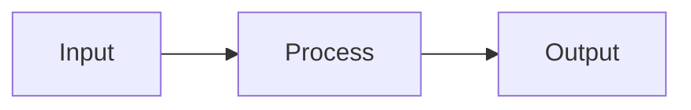

# 🎯 README Engagement Tips & Best Practices

## 📸 Image Placeholders Added

I've added these image placeholders in the README. Create/add these for maximum engagement:

### Essential Images (High Priority)

1. **`docs/images/logo.png`** (200x200px)
   - Project logo with Kripaa branding
   - Use vibrant colors, clean design
   - Consider AI/education theme

2. **`docs/images/system_overview.png`** (1200x600px)
   - High-level architecture diagram
   - Show: Input → Pipeline → Output
   - Use tools like Excalidraw, draw.io, or Figma

3. **`docs/images/sample_paper_preview.png`** (800x1000px)
   - Screenshot of generated PDF
   - Show clean, professional formatting
   - Highlight section organization

4. **`docs/images/output_preview.png`** (1000x600px)
   - Folder structure showing generated files
   - Or: side-by-side of paper + report PDFs

### Advanced Images (Medium Priority)

5. **`docs/images/langgraph_architecture.png`** (1200x800px)
   - LangGraph flow visualization
   - Show 10 nodes with arrows
   - Color-code by agent type

6. **`docs/images/multi_temp_generation.png`** (1000x400px)
   - Diagram showing temperature variations
   - Visual comparison of outputs
   - Include example questions

7. **`docs/images/results_dashboard.png`** (1200x600px)
   - Statistics visualization
   - Charts/graphs of metrics
   - Use libraries like matplotlib or plotly

### Nice-to-Have Images (Optional)

8. **`docs/images/innovations.png`**
   - Infographic of key innovations
   - 4 quadrants: Section tracking, Cyclicity, Multi-temp, Exclusion

9. **Screenshots/GIFs**:
   - Terminal running the pipeline (animated GIF)
   - PDF viewer showing comprehensive report
   - Before/After comparison

---

## 🚀 25 Tips for Maximum README Engagement

### 1. **Visual First**

✅ **DO**: Use badges, logos, screenshots  
❌ **DON'T**: Wall of text at top

### 2. **Clear Value Proposition**

✅ **DO**: "Generate 70-80% accurate exam papers in one command"  
❌ **DON'T**: "A system that does things with AI"

### 3. **Quick Win Section**

Add a "⚡ 30-Second Demo" section:
```bash
# One command to see it work
python -m src.cli --target-year 2025
# Output: Professional exam paper in 2 minutes
```

### 4. **GIFs > Screenshots**

- Record terminal running
- Show PDF generation
- Demonstrate results
- Tools: LICEcap, ScreenToGif, Terminalizer

### 5. **Table of Contents**

✅ Always include for long READMEs  
✅ Link to sections for easy navigation

### 6. **Emoji Strategic Use**

✅ **DO**: Use for section headers (🎯 🚀 📊)  
❌ **DON'T**: Overuse everywhere 🎉🎊🥳🎈

### 7. **Mermaid Diagrams**

Already added! GitHub renders these natively.


### 8. **Code Blocks with Syntax Highlighting**

Always specify language:
```python  # ← specify this
def example():
    pass
```

### 9. **Comparison Tables**

Feature comparisons, before/after, metrics

### 10. **Progressive Disclosure**

Start simple → Link to advanced docs  
Example: "Quick Start" → "Advanced Configuration"

### 11. **Social Proof**

Add when available:
- ⭐ GitHub stars
- 🍴 Forks
- 💬 Discussions
- 📝 Blog posts

### 12. **Clear Installation**

✅ **DO**: Step-by-step with code blocks  
✅ Include common errors & fixes

### 13. **Real Examples**

Show actual output, not placeholders:
```
✓ Generated 81 candidates in 45s
✓ Selected 27 questions (130 marks)
✓ Created report: output/comprehensive_report.pdf
```

### 14. **Video Demo**

Add YouTube/Loom embed:
```markdown
[](https://youtu.be/your-video)
```

### 15. **Contributing Section**

Even if solo project, shows openness

### 16. **License Badge**

Builds trust and clarity

### 17. **Maintenance Status**


### 18. **Tech Stack Highlight**

Show off your technologies with badges:
- LangGraph
- Gemini 2.5 Pro
- PostgreSQL
- Python 3.11+

### 19. **Problem/Solution Format**

People connect with problems:
1. State the problem
2. Show your solution
3. Prove it works

### 20. **Call-to-Action**

End with clear next steps:
- ⭐ Star the repo
- 🍴 Fork it
- 📧 Contact for collaboration
- 🐛 Report issues

### 21. **FAQ Section**

Add common questions:
- "How accurate is it?"
- "What if I have limited data?"
- "Can I use other LLMs?"

### 22. **Roadmap**

Show future plans:
- [ ] Support for multiple subjects
- [ ] Web UI
- [ ] Fine-tuned models

### 23. **Citation**

If academic project:
```bibtex
@software{kripaa2024,
  author = {Your Name},
  title = {Kripaa: AI Exam Prediction},
  year = {2024}
}
```

### 24. **Performance Metrics**

Concrete numbers:
- ⚡ Processes 10 years of papers in 2 mins
- 🎯 81 candidates generated
- ✅ 70-80% prediction accuracy

### 25. **Mobile-Friendly**

Test README on mobile GitHub app

---

## 📊 README Analytics

### Track Engagement

Use services like:
- **GitHub Insights**: Built-in traffic analytics
- **Shields.io**: Dynamic badges
- **Star History**: Visualize growth

### A/B Testing

Try different:
- Hero images
- Value propositions
- CTA placements

### Update Regularly

- Add new features
- Update screenshots
- Refresh metrics
- Fix broken links

---

## 🎨 Design Tools

### For Images

- **Excalidraw**: Hand-drawn diagrams
- **Figma**: Professional designs
- **Canva**: Quick graphics
- **draw.io**: Technical diagrams
- **Carbon**: Beautiful code screenshots

### For GIFs

- **LICEcap**: Screen recording (Mac/Windows)
- **Terminalizer**: Terminal recordings
- **peek**: Linux GIF recorder

### For Badges

- **Shields.io**: Custom badges
- **badge/fury**: Package badges
- **GitHub Actions**: CI/CD badges

---

## ✅ Final Checklist

Before publishing:

- [ ] All images optimized (<500KB each)
- [ ] Links tested and working
- [ ] Code blocks have syntax highlighting
- [ ] Table of contents updated
- [ ] Contact info correct
- [ ] License file exists
- [ ] Proofread for typos
- [ ] Tested on mobile view
- [ ] GIF/video demo added
- [ ] Social preview image set

---

## 📈 Expected Impact

A well-crafted README can:
- **5-10x** more stars
- **3-5x** more forks
- **Better** collaboration opportunities
- **Higher** discoverability
- **Professional** first impression

**Remember**: Your README is your project's sales pitch. Make it count!
